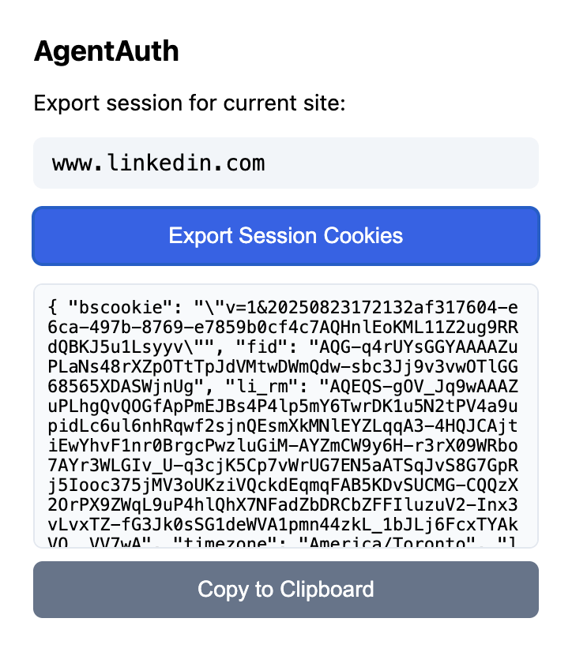
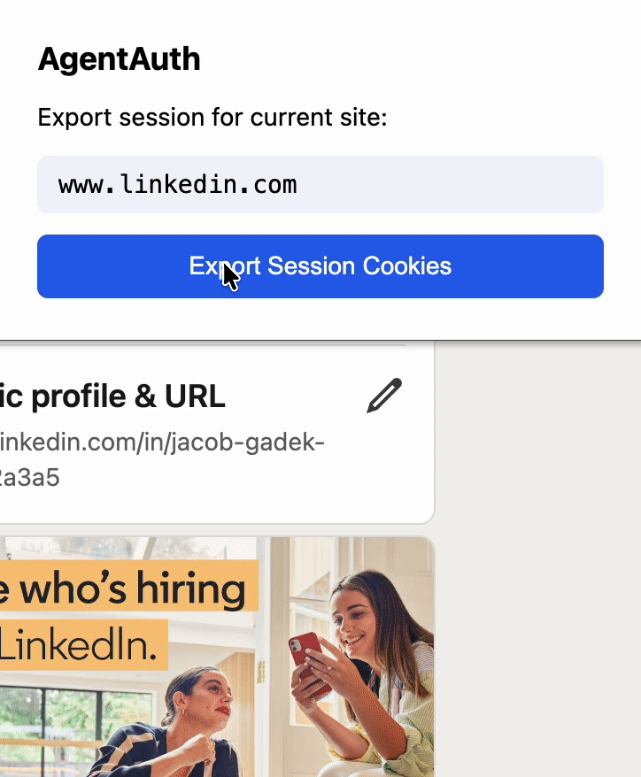

# AgentAuth

**Stop hardcoding cookies. Persistent auth for AI agents.**

```python
# Before (hardcoding cookies)
cookies = {"session_id": "abc123..."}  # breaks constantly

# After (AgentAuth)
from agent_auth import Vault
vault = Vault()
vault.unlock("password")
cookies = vault.get_session("linkedin.com")
```

```bash
pip install agent-auth
```

## The Problem

Every AI agent developer hardcodes cookies in their code. Sessions expire and break your agent. There's no way to track which agent accessed what. One hardcoded cookie leak, and your entire account is compromised.

**AgentAuth fixes this.**

## How It Works






1. **Export cookies** with the Chrome extension while logged into any site
2. **Store them** in an encrypted vault (`agent-auth add linkedin.com`)
3. **Your agent retrieves them** securely on-demand

## Quick Start

```python
from agent_auth import Agent, AgentAuthClient

agent = Agent.load("sales-bot")
client = AgentAuthClient(agent)
session = client.get_session("linkedin.com")

import requests
response = requests.get("https://linkedin.com/feed", cookies=session)
```

## Features

- **Encrypted Storage** - Sessions stored securely in a local vault
- **Scoped Access** - Agents can only access domains you explicitly approve
- **No Hardcoded Secrets** - Sessions managed separately from your code
- **Session Expiration** - Automatic checking and notifications when sessions expire
- **Easy Management** - Export cookies with browser extension, store with CLI

## LangChain Integration

AgentAuth provides seamless integration with LangChain agents through pre-built tools that handle authenticated requests automatically.

### Available Tools

1. **`authenticated_request`** - Makes authenticated HTTP requests using stored session cookies. Perfect for accessing sites that require login (LinkedIn, Gmail, etc.)
2. **`get_session_cookies`** - Retrieves session cookies for a domain. Use this when you need cookies to make your own custom requests.

### Example Usage

```python
from langchain_openai import ChatOpenAI
from langchain.agents import initialize_agent, AgentType
from agent_auth.langchain import get_agentauth_tools

# Get AgentAuth tools for your agent
tools = get_agentauth_tools(
    agent_name="sales-bot",
    vault_password="your-vault-password"
)

# Initialize the LLM
llm = ChatOpenAI(model="gpt-4", temperature=0)

# Create the agent with AgentAuth tools
agent = initialize_agent(
    tools=tools,
    llm=llm,
    agent=AgentType.ZERO_SHOT_REACT_DESCRIPTION,
    verbose=True
)

# Run a query that requires authentication
response = agent.run("Get my LinkedIn notifications")
```

The agent will automatically use the `authenticated_request` tool to access LinkedIn with your stored session cookies, making authenticated API calls on your behalf.

## Examples

Working demo that accesses GitHub using stored sessions.

### GitHub Agent Demo

**Setup:**

1. Create the agent:
```bash
agent-auth create-agent github-agent --scopes github.com
```

2. Export cookies from github.com using the Chrome extension

3. Add the session:
```bash
agent-auth add github.com
```

**Run:**
```bash
PYTHONPATH=. python examples/github_agent.py
```

The example accesses GitHub notifications and starred repos using your stored session cookies. All examples are available in the `examples/` folder.

## Setup

### 1. Initialize the vault
```bash
agent-auth init
```

### 2. Create an agent
```bash
agent-auth create-agent sales-bot --scopes linkedin.com,gmail.com
```

### 3. Add a session
```bash
agent-auth add linkedin.com
# Paste the cookies exported from the Chrome extension
```

## CLI Commands

| Command | Description |
|---------|-------------|
| `agent-auth init` | Initialize encrypted vault |
| `agent-auth add <domain>` | Add a session for a domain |
| `agent-auth list` | List all stored sessions |
| `agent-auth create-agent <name> --scopes <domains>` | Create agent identity |
| `agent-auth agents` | List all registered agents |

## Technical Details

AgentAuth uses industry-standard security practices:

- **Encryption** - Sessions encrypted with AES-256 using PBKDF2 key derivation (100,000 iterations)
- **Agent Identities** - Each agent has a unique cryptographic identity (Ed25519 keypair) for authentication
- **Audit Logging** - All session access is logged with agent ID, domain, and timestamp
- **SQLite Database** - Sessions stored in encrypted SQLite database at `~/.agent-auth/vault.db`

## License

MIT
